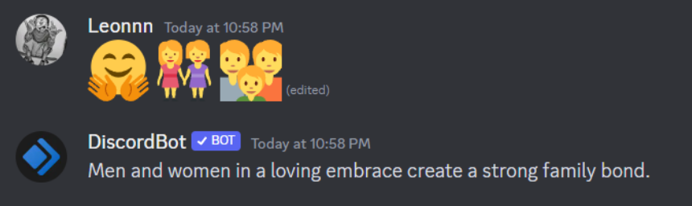

<p align="center">
  
  <h1 align="center" ><b>EmojisBot - Transform Emojis into Sentence </b></h1>
<!--   <p align="center">📖 Show your latest Medium article on your READMEs!</p> -->
</p>


## Introduction

This project focuses on making it easier to understand and express emotions using emojis in digital conversations. This project interprets meaning in sets of three emojis using machine learning. It generates contextually relevant sentences, bridging the gap between emojis and natural language.

## Project Overview

We aim to design a Discord bot that can analyze and interpret Combination of emojis and respond with well-constructed sentences that convey the intended meaning behind the emojis. 
<p align="center">
  
  
<!--   <p align="center">📖 Show your latest Medium article on your READMEs!</p> -->
</p>

## Methodology 1

We will use image recognition to identify the emojis into text/label. Afterwards we send this text into the Transformer for sentence generation and sentimental analysis.
Flow: Emoji->Image Recognition->Emoji Label(Text)->Language Transformer->Sentence

## Methodology 2

We will convert the emoji into its unicode representation, which will be translated into text (label). Afterwards we will send this text into the Transformer for sentence generation and sentimental analysis.
Flow: Emoji->Unicode Representation->Emoji Label (Text)->Language Transformer->Sentence

## Participants

- **Kenneth Edgar 109006211 - Model Design, Datasets and Research **
- **Vincent Leon 109006230 - Datasets, Research and GitHub Management **
- **Dominick Matthew Singgih 施平治 109006210 - Visualizing Data, Datasets, and Research **
- **Jansen Reynaldi Gautama 劉其生 109006240 - Model to Discord integration, Dataset and Research **
- **Edbert Fuji Wijaya 110006164 - Dataset and Research **
- **Rémi Antonucci X1120012 - Visualizing Data, Dataset, Research, and GitHub Management**

  ## Getting Started

1. Clone the repository:

   ```bash
   git clone https://github.com/your-username/IntroML---Emojis-to-text-project.git
   cd IntroML---Emojis-to-text-project
   pip install -r requirements.txt
   
   
   
